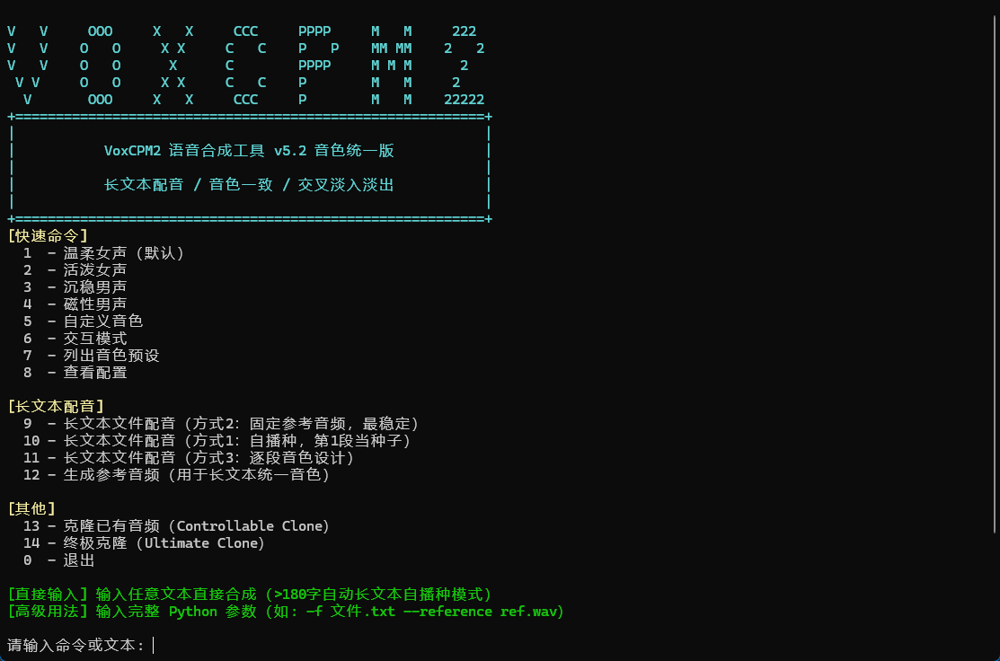
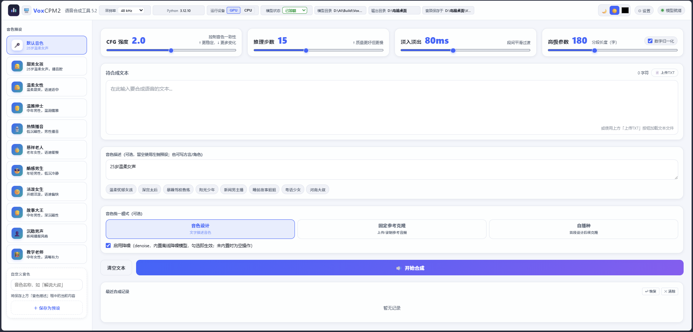
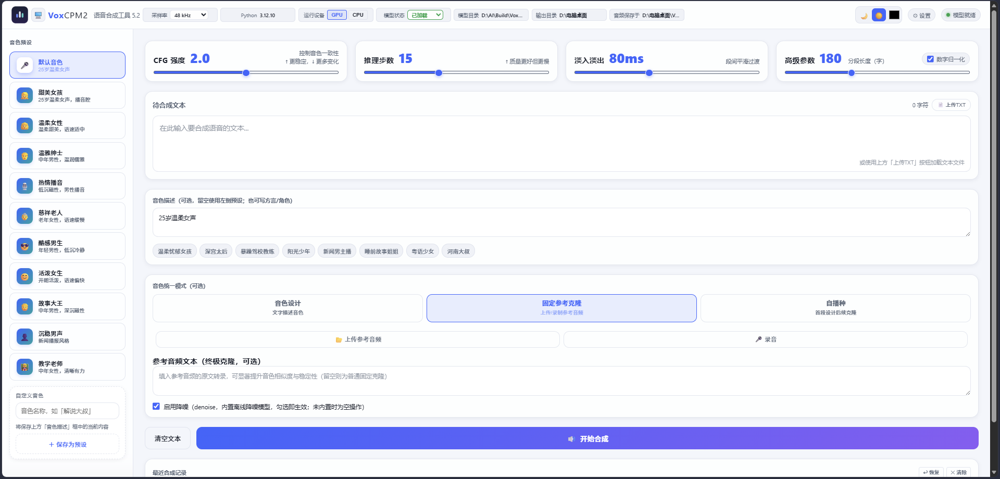
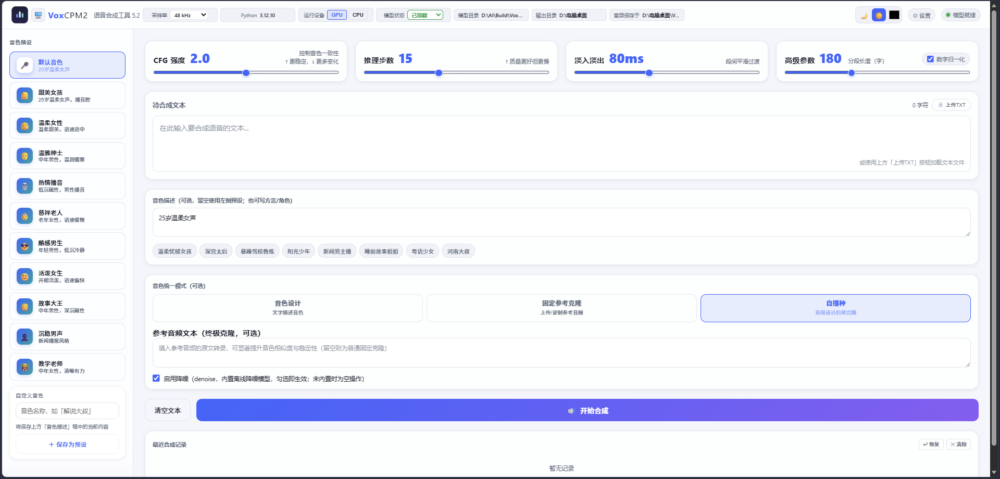
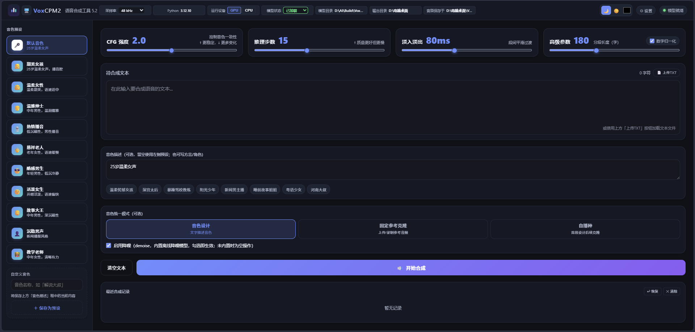

# VoxCPM2 TTS 安装与使用图文教程

> 适用版本：v5.3 / v5.3.1（无模型版）  
> 系统：Windows 10/11，64 位；有 NVIDIA 显卡自动走 CUDA，无显卡自动 CPU 回退。

## 1. 下载安装包

从下列地址下载对应安装包：

| 类型 | 下载地址 | 文件 | 大小 |
|------|----------|------|------|
| **完整版** | https://www.alipan.com/s/jraDcmeo1y6（提取码 `i9u7`） | `VoxCPM2_TTS_v5.3_Setup.exe` + 3 个 `.bin` | 约 5.24 GB |
| **无模型版** | https://github.com/dandelion80231/VoxCPM2Dist/releases/tag/v5.3.1 | `VoxCPM2_TTS_v5.3_nomodel_Setup.exe` | 约 1.56 GB |

> ⚠️ **完整版 4 个文件必须放在同一文件夹**，双击 `.exe` 即可，安装程序会自动读取 `.bin` 分卷。

> 💡 无模型版是**单个自包含 `.exe`**，无需额外文件，双击即安装。

## 2. 安装

1. 双击安装包（Windows 可能弹出「Windows 已保护你的电脑」——点击「更多信息」→「仍要运行」）。
2. 在安装向导中选择安装目录（默认 `C:\Program Files\VoxCPM2 TTS`）。
3. 勾选「创建桌面快捷方式」和「安装完成后立即运行」（可选）。
4. 等待安装完成。完整版解压模型约需 1–2 分钟（SSD），无模型版更快。

安装完成后，桌面会出现两个快捷方式：

- **VoxCPM2 TTS 中文版 - 交互菜单**：命令行图形菜单
- **VoxCPM2 TTS 中文版 - 网页界面**：浏览器图形界面

## 3. 无模型版首次下载模型

安装完成后首次启动，程序会提示「模型缺失」。请按以下任一方式获取模型：

> 💡 **关于数字归一化**：把「2025年」「5.6%」「GPT-5」「2亿」转成中文读法是程序内置的**正则规则**（`text_norm_cn.py`，零依赖、无需下载），无模型版安装包已自带。规则还会把订单号/账号等编号逐位读、`NASA`/`Intel`/`Google` 等机构品牌名按单词读（其余缩写如 `CPU` 仍逐字母读）。本节所说的「模型」仅指 **VoxCPM2 主模型**（必备）与可选的 **ZipEnhancer 降噪模型**；规则细节与白名单扩展方法见《开发经验与避雷手册》§2.5。

### 方式一：一键下载（推荐）

1. 打开安装目录，双击 **`下载模型.bat`**。
2. 脚本会优先从 **ModelScope** 下载（国内速度较快），失败自动回退 **HuggingFace**。
3. 下载约 4.6 GB 的模型文件到 `安装目录\model\openbmb\VoxCPM2\`。
4. 下载完成后重新启动程序即可。

> 💡 脚本会**先检测缺漏再下载**：启动后先扫描全部必需文件，已完整下载的自动跳过，只下载缺失或损坏的文件（支持断点续传），不会无脑重下。

### 方式二：手动下载（可借多线程下载器加速）

如果你有更快的多线程下载器（如 IDM、aria2、迅雷、Motrix 等），可手动从以下公开源拉取后放入指定目录，往往比脚本内置下载更快：

| 来源 | 地址 |
|------|------|
| HuggingFace | https://huggingface.co/openbmb/VoxCPM2 |
| ModelScope | https://modelscope.cn/models/OpenBMB/VoxCPM2 |
| 夸克网盘（国内直连） | https://pan.quark.cn/s/42994c0df601 |

**放置位置**：将下载到的文件放入

```
安装目录\model\openbmb\VoxCPM2\
```

必需文件包括：`model.safetensors`、`audiovae.pth`、`config.json`、`tokenizer*`、`tokenization_voxcpm2.py`。

> 💡 手动放好后无需运行 `下载模型.bat`，直接重启程序即可识别模型。

### 关于离线降噪模型（ZipEnhancer）

无模型版**安装包不含**离线降噪模型（打包时整个 `app/models/` 目录被排除，主模型在 `app/model/`、降噪模型在 `app/models/zipenhancer/`，二者都在排除范围）。但**无需手动处理**：运行「下载模型.bat」会自动把主模型与降噪模型一并下载到位（降噪约 18MB，断点续传）。

- 缺失时**不影响基础合成**：程序检测到 `models\zipenhancer\configuration.json` 不存在会自动降级，降噪变为空操作，语音照常生成。
- 若你用多线程下载器更快、或脚本下载失败，也可手动补回（任选其一）：

  **方式一：从完整版拷贝（最简单）**
  把完整版安装目录里的 `models\zipenhancer\` 整个文件夹，复制到无模型版安装目录下同名位置：

  ```
  安装目录\models\zipenhancer\
  ```

  **方式二：手动下载（可借多线程下载器加速）**
  从 ModelScope 下载 `iic/speech_zipenhancer_ans_multiloss_16k_base`（约 18MB）：

  | 来源 | 地址 |
  |------|------|
  | ModelScope | https://modelscope.cn/models/iic/speech_zipenhancer_ans_multiloss_16k_base |

  命令行：`modelscope download --model iic/speech_zipenhancer_ans_multiloss_16k_base --local-dir 安装目录\models\zipenhancer`
  或用 ModelScope 网页 / 多线程下载器把仓库文件取到本地后放入 `安装目录\models\zipenhancer\`。

- 补回后**重启程序**即自动启用；网页界面会在路径面板显示「降噪模型：已内置（离线可用）」。

## 4. 使用交互菜单（CLI）

双击桌面的**交互菜单**快捷方式，会打开 PowerShell 图形菜单：



**快速操作：**

- 输入 `1` 使用「温柔女声」直接合成
- 输入 `6` 进入交互模式
- 输入 `9` 长文本文件配音（固定参考，最稳定）
- 输入 `10` 长文本文件配音（自播种，第 1 段当种子）
- 直接输入任意文本即可合成（>180 字自动走自播种长文本模式）

## 5. 使用网页界面

双击桌面的**网页界面**快捷方式，浏览器会自动打开 `http://127.0.0.1:18978`（若端口被占用会自动顺延）。

网页界面提供三种音色工作模式：

### 5.1 音色设计

用文字描述你想要的音色，让模型直接「设计」声音。



### 5.2 固定参考克隆

上传或录制一段参考音频，克隆该音色。



### 5.3 自播种

无需提供参考音频，自动生成参考音频完成音色统一。



### 5.4 深色主题

网页界面支持深色/浅色主题切换，照顾不同光线环境。



## 6. 常用参数说明

| 参数 | 含义 | 建议 |
|------|------|------|
| CFG 强度 | 音色与文本的贴合度 | 默认 2.0，越大越贴合文本 |
| 推理步数 | 扩散采样步数 | 默认 15，速度与质量平衡 |
| 淡入淡出 | 段间交叉淡入淡出时长 | 默认 80ms，减少拼接断裂 |
| 高级参数 | 分段长度（字） | 默认 180，长文本会自动分段 |
| 启用降噪 | 使用 ZipEnhancer 离线降噪 | 随完整版内置，无模型版缺失时为空操作 |

## 7. 输出与目录

- **合成输出**：默认保存到 `安装目录\output\`
- **网页端可自定义**：顶部状态栏可点击修改模型目录、输出目录
- **缓存目录**：`安装目录\cache\voxcpm_web_ui\`（避免系统 Temp 被清理导致报错）

## 8. 常见问题

**Q：安装时进度条卡住很久？**  
A：完整版解压约 4.6GB 模型文件，首次安装需 1–2 分钟（SSD）。若超过 10 分钟不动，请检查 7za 是否被安全软件拦截。

**Q：无模型版下载模型失败？**  
A：确认网络通畅，脚本会自动切换 ModelScope / HuggingFace。也可手动从 https://pan.quark.cn/s/42994c0df601 下载模型文件放到 `model\openbmb\VoxCPM2\`。

**Q：网页界面打不开？**  
A：检查端口 18978 是否被占用，程序会自动顺延端口；也可直接打开 `http://127.0.0.1:18978`。

**Q：没有 NVIDIA 显卡能用吗？**  
A：可以。程序会自动 CPU 回退，速度较慢但可用。

---

更多高级用法，请参考项目根目录 `README.md`。
